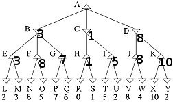

+++
title = "HW3"
+++

## Question

 (12\%) Consider the following game tree in which the static heuristic scores are given for all the tip nodes.
\begin{center}
 \includegraphics{gametree.jpg}
 % gametree.jpg: 0x0 pixel, 0dpi, nanxnan cm, bb=
\end{center}

   1. What move should MAX choose?

   2. Which nodes would not need to be examined using the alpha-beta algorithm -- assuming that nodes are examined in left-to-right order?

   3. What changes of values assigned to the leaves are necessary so that the maximum amount of prunning will occur? How many additional nodes would be pruned this way? 

### Solution
The Minmax values for all nodes in the game tree are shown in the below figure.

{caption="" class="thumbnail"}

1. MAX should choose node D, because it yields the best returns against an optimal opponent.

2. When \\(\alpha\beta\\) pruning is used, and when the nodes are examined in left to right order, the following nodes are not examined : O,Q,I,T,U,Y are not examined.

3. For maximum pruning to occur, the values at the leaves can be changed as follows: V and W can be assigned the values 0 and 1. In that case, the nodes K,X are not expanded. Thus, 2 additional nodes are pruned.

## Question
 (20\%) Consider the following procedure for choosing moves in games with chance nodes:

   1. Generate a suitable (say, 200) dice-roll sequences down to a suitable depth (say, 8).

   2. With known die rolls, the game tree becomes deterministic. For each die-roll sequence, solve the resulting deterministic game tree using alpha-beta.

   3. Use the results to estimate the value of each top-level move and choose the best one. 

Will this procedure work correctly? Why (not)?

### Solution

What is the `suitable' number of dice rolls to use? Rolling a pair of dice 8 times results in one of \\(15^{8}\\) distinct sequences. Consider the use of expectiminimax algorithm which evaluates trees 8-dice-rolls deep to determine the next move in a game of chance. That algorithm takes into account, for each possible move, all of those sequences (the use of alpha-beta pruning reduces that number), while considering the probability of each move of the sequence.

The strategy of drawing an inference from only a set of 200 unique 8-roll sequences cannot be as accurate as the above mentioned algorithm. (One would draw the inference about the move to make next by considering for each move the MINIMAX values for the 200 game trees which result from the 200 sequences.) But, if one were to generate the 200 most probable sequences, one's move/ strategy in the game will be more likely to approach the optimal strategy closer. You can also approach the optimum strategy by simply evaluating a greater number of die-rolls.

## Question

 (16\%) Suppose we play a variant of Tic-Tac-Toe in which each player sees only his or her own moves. If the player makes a move on a square occupied by an opponent, the board "beeps" and the player gets another try. Would the backgammon model (the EXPECTIMAX-EXPECTIMIN algorithm described in Section 5.5) suffice for this game, or would we need something more sophisticated? Why?

### Solution

Suppose that the player could observe all the opponent's pieces. Then, he could deduce the move the optimal opponent would make. Hiding of the opponent's pieces from view introduces an element of uncertainty about the opponent's pieces, and hence there is uncertainty about the best move to make.

Once can deal with this element of chance by the use of chance nodes, with the EXPECTIMAX-EXPECTIMIN algorithm, in the same way as it is used in the backgammon model. But, some refinement is needed to deal with the fact that each beep tells the the player something about the position of the opponent's pieces.

At each step during the game, the player should use the EXPECTIMAX-EXPECTIMIN algorithm, but, he should reconsider the assignments of probabilities to the edges emanating from the chance nodes of the expectiminimax tree whenever he gets a `beep'.

## Question
 (20\%) Knowledge representation in first-order logic. Represent the following sentences in first-order logic, using a consistent vocabulary (which you must define):

   1. The best score in CS683 is always higher than the best score in CS610.

   2. No one in this neighborhood buys flood insurance.

   3. None of the President's aides has issued this statement.

   4. The President's aides issued conflicting statements.

   5. Politicians can fool some of the people all the time, and they can fool all the people some of the time, but they can't fool all of the people all of the time. 

### Solution

#### The best score in CS683 is always higher than the best score in CS610.

CS683 and CS610 are constants.

fBestScore(x,t) is a function which maps x to the entity which is best score in x during the time interval t.

greater(A,B) is a predicate which says that the entity A is greater than entity B.

We have the sentence:

\\( \forall t, greater(fBestScore(CS683,t),fBestScore(CS610,t)) \\)

#### 2. No one in this neighborhood buys flood insurance.

Y is a constant which represents this neighborhood.

inNeighborhood(x,y) is a predicate which says that x belongs to the neighborhood y.

buysFloodInsurance(x) is a predicate which says that x buys flood insurance.

We have the sentence:

\\(\forall x, inNeighborhood(x,Y) \Rightarrow \sim buysFloodInsurance(x)\\)

#### 3. None of the President's aides has issued this statement.

S is a constant which represents this statement.

issuedStatement(x,s) is a predicate which says that x issued the statement s.

presidentialAide(x) is a predicate which says that x is the President's aide.

We have the sentence:
\\(\forall x, presidentialAide(x) \Rightarrow \sim issuedStatement(x,S)\\)

#### 4. The President's aides issued conflicting statements.

conflictingStatement(s) is a function which maps the statement s to a statement which conflicts with it.

issuedStatement(x,s) is a predicate which says that x issued the statement s.

presidentialAide(x) is a predicate which says that x is the President's aide.

We have the sentence:
\\(\exists x \exists y \exists s, presidentialAide(x) \wedge presidentialAide(y) \wedge issuedStatement(x,s) \wedge issuedStatement(y,conflictingStatement(s))\\)

#### 5. Politicians can fool some of the people all the time, and they can fool all the people some of the time, but they can't fool all of the people all of the time. 

politician(x) is a predicate which says that x is a politician.

fools(x,y,t) is a predicate which says that x fools y during the time-interval t.

isTimeInterval(t) is a predicate which says that t is a time-interval.

We have the sentences:
\\(\forall x, \forall t, \exists y: isTimeInterval(t) \wedge politician(x) \Rightarrow fools(x,y,t)\\)

\\(\forall x, \forall y, \exists t: isTimeInterval(t) \wedge politician(x) \Rightarrow fools(x,y,t)\\)

\\(\sim ( \exists x, \forall y, \forall t:  politician(x) \Rightarrow fools(x,y,t))\\)

The given english sentence is a conjunction of the above first order logic statements.

## Question

 (16\%) Backward-chaining inference. Consider the following set of Horn sentences:

[1]      \\(\forall x,y,z Greater(x,y) ∧ Greater(y,z) \Rightarrow Greater(x,z)\\)

[2]      \\(\forall x A(x) \Rightarrow Greater(Score(x),90)\\)

[3]      \\(\forall x Greater(Score(x),90) \Rightarrow A(x)\\)

[4]      A(Alex)

[5]      Greater(Score(Deb),Score(Alex))

Prove A(Deb) using backward-chaining.

### Solution

Initially, your goal-list consists of A(Deb).

(`Consequence' is the portion of a statement which follows the \\(\Rightarrow\\) sign.)

Note that A(x) in the consequence of [3] unifies with the goal A(Deb) with the substitution (x=Deb). Now, after the above unification, make the goal list include Greater(Score(Deb),90).

Note that Greater(x,z) in [1] unifies with the goal Greater(Score(Deb),90) with the substitutions x=Score(Deb) and z=90. Now, after the above unification, make the goal list consist of Greater(Score(Deb),y) and Greater(y,90).

Note that Greater(Score(Deb),Score(Alex)) in [5] unifies with the goal Greater(Score(Deb),y) with the substitution y=Score(Alex). Now, after the above unification, cause the goal list consist of Greater(Score(Alex),90).

Note that Greater(Score(x),90) in the consequence of [2] unifies with the goal Greater(Score(Alex),90) with the substitution (x=Alex). Now, after the above unification, make the goal list consist of A(Alex).

But note that A(Alex) agrees with [4]! Thus we have used backward chaining to prove the validity of the argument: Knowledge Base \\(\vdash\\) A(Deb)!

## Question
 (16\%) If a course is easy, some students are happy. If a course has a final, no students are happy. Use resolution to show that, if a course has a final, the course is not easy.

### Solution

It is given:

[1] \\(\forall x, \exists y: easy(x) \Rightarrow happy(y)\\)

[2] \\(\forall x, \forall y: hasFinal(x) \Rightarrow ~happy(y)\\)

We want to prove the sentence:

[3] \\(\forall x, hasFinal(x) \Rightarrow \sim easy(x)\\)

To arrive at a proof by contradiction, we will resolve the knowledge base against the following negation of [3]:

\\(\exists x, \sim(\sim hasFinal(x) \vee \sim easy(x))\\), which, after existential instantiation, is: \\(\sim(\sim hasFinal(A) \vee \sim easy(A))\\).

This may be reduced to the clauses:

[3.1]hasFinal(A)

[3.2]easy(A)

Using a Skolem function \\(courseToHappyStudent:x\longrightarrow y\\), [1] can be converted to:

[1.1] \\(\forall x: easy(x) \Rightarrow happy(courseToHappyStudent(x))\\)

Eliminating the universal quantification in [1.1] and [2], we get:

[1.2] \\(easy(x1) \Rightarrow happy(courseToHappyStudent(x1))\\)

[2.1] \\(hasFinal(x2) \Rightarrow \sim happy(y1)\\)

Converting all of the above to clauses (disjunciton of literals), we get:

[1.3] \\(\sim easy(x1) \vee happy(courseToHappyStudent(x1))\\)

[2.2] \\(\sim hasFinal(x2) \vee \sim happy(y2)\\)

[3.1] hasFinal(A)

[3.2] easy(A)

Unifying and resolving [1.3] and [3.2], we derive the following sentence:

[4] happy(courseToHappyStudent(A))

Unifying and resolving [2.2] and [3.1], we derive the following sentence:

[5] \\(\sim happy(y2)\\)

When we unify and resolve [4] and [5], we arrive at an empty clause. Hence, starting from the assumption that negation of [3] is true, we have arrived at a contradiction. So, the negation of [3] should be false.

Hence, we have proved with the use of resolution that [3] is true.

