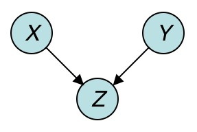
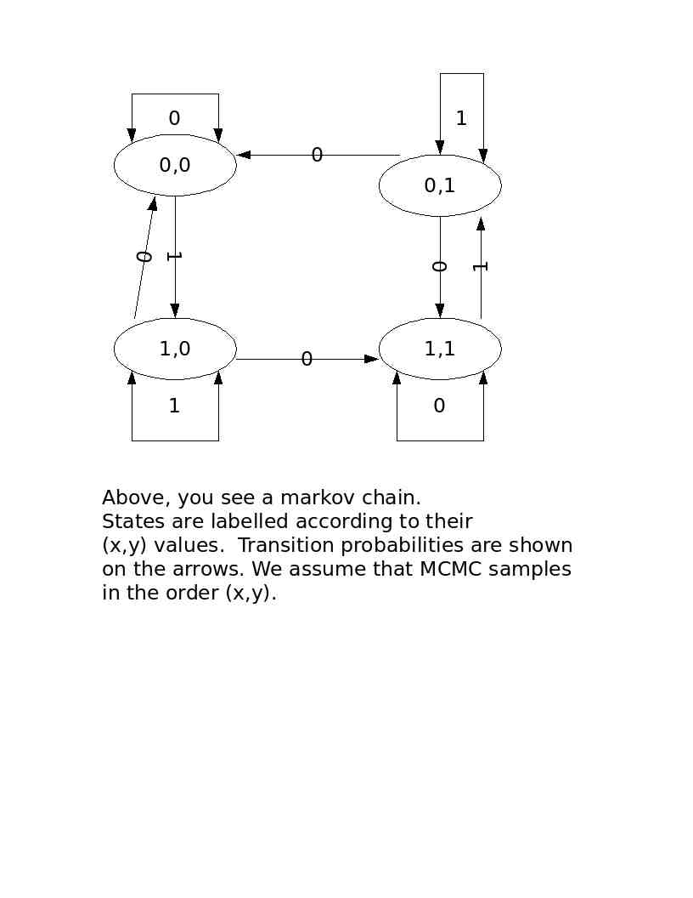
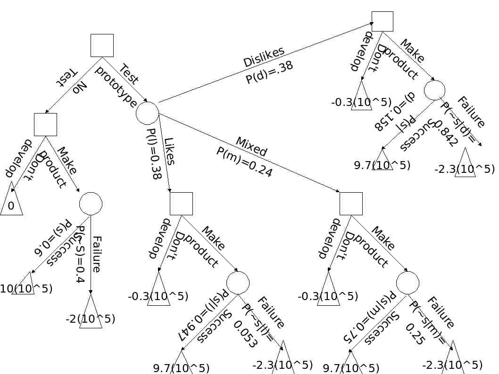

+++
title = "HW5"
+++

## Question

(30\%) Consider the application of the Markov chain Monte Carlo (MCMC) algorithm to a Bayesian network.
#### 1
. Recall that the Markov blanket of a variable in a Bayesian network is the set that includes the variable's parents, children, and children's parents. Derive Equation 14.11 from the textbook. That is, show that the probability of a variable given its Markov blanket is proportional to the probability of the variable given its parents times the probability of each child given its respective parents:

\\(P(x_{i}|MB(X_{i}))=\alpha P(x_{i}|Parents(X_{i}))\Pi_{Y_{j}\in Children(X_{i})} P(y_{j}|Parents(Y_{j}))\\)
#### 2
. Now, consider the following network, where the variables are all binary:

{caption="" class="thumbnail"}

X and Y are both uniformly distributed, and Z is the deterministic exclusive or of X and Y. Show that running MCMC on this structure with the evidence z=1 will estimate \\(P(x=1|z=1)\\) as either 1 or 0. Why does this happen?
#### 3
. What will happen if we make Z a slightly noisy exclusive or of its parents? That is, with some small probability q, Z is chosen at random with uniform distribution regardless of the values of X and Y, and with probability 1-q, Z is the exclusive or of X and Y. What can you conclude about problems that MCMC can encounter in its attempts to do a random walk? 

### Solution

#### 1
 We are to prove that:

\\(P(x_{i}|MB(X_{i}))=\alpha P(x_{i}|Parents(X_{i}))\prod_{Y_{j}\in Children(X_{i})} P(y_{j}|Parents(Y_{j}))\\)

From the definition of conditional probability, \\(P(x_{i}|MB(X_{i}))=\frac{P(x_{i}MB(X_{i}))}{P(MB(X_{i}))}\\)

As \\(P(MB(X_{i})\\) is a constant, we can write this as: 

\\(P(x_{i}|MB(X_{i}))=\beta P(x_{i}MB(X_{i}))\\), where \\(\beta\\) is a constant.

Note that \\(P(x_{i}MB(X_{i}))\\) refers to the event where \\(X_{i}\\) is assigned a value \\(x_{i}\\), and \\(MB(X_{i})\\) represents an assignment fo certain values to the Markov Blanket of \\(X_{i}\\).

Consider the DAG, a subgraph of the original bayesnet, spanned by the union of \\(X_{i}\\) and \\(MB(X_{i})\\). The semantics of a Bayesian network tell us how to calulate the joint probability of the variables present in this DAG. Note that the leaf nodes in this DAG comprise exactly of \\(Children(X_{i})\\). Let the parents of \\(X_{i}\cup Children(X_{i})\\) be called \\(DAGRoots\\). Thus, we get:

$$\begin{eqnarray}
P(x_{i}MB(X_{i}))  & =  & \prod_{Y_{j}\in Children(X_{i})} P(y_{j}|Parents(Y_{j})) \nonumber \\
& & P(x_{i}|Parents(X_{i})) \prod_{Z_{k}\in DAGRoots}P(Z_{k})\\
\end{eqnarray}$$

Hence, 
$$\begin{eqnarray}
P(x_{i}|MB(X_{i})) & = & \beta P(x_{i}MB(X_{i}))\\
 & = & \prod_{Y_{j}\in Children(X_{i})} P(y_{j}|Parents(Y_{j})) P(x_{i}|Parents(X_{i}))\\
& & \prod_{Z_{k}\in DAGRoots}P(Z_{k})
\end{eqnarray}$$

Letting \\(\alpha = \beta\prod_{Z_{k}\in DAGRoots}P(Z_{k})\\), we get:
$$\begin{eqnarray}
P(x_{i}|MB(X_{i})) & = &\alpha P(x_{i}|Parents(X_{i})) \nonumber \\
& & \prod_{Y_{j}\in Children(X_{i})} P(y_{j}|Parents(Y_{j}))
\end{eqnarray}$$

Thus, we have shown that the probability of a variable given its Markov blanket is proportional to the probability of the variable given its parents times the probability of each child given its respective parents.
#### 2
. The Markov chain traversed by the MCMC algorithm trying to estimate the value of \\(P(X=1|Z=1)\\) is shown below. The initial state can be any of the four shown, with equal probability. The order in which non evidence variables are sampled by the MCMC algorithm is assumed to be (x,y). Transitions (0,0)--(0,1) and (1,1)--(1,0) are not shown, as they never occur in a MCMC implementation using the (x,y) ordering while sampling.

{caption="" class="thumbnail"}

 The above figure follows directly from the description of the MCMC algorithm provided in the textbook. The transition probabilities are calculated by finding the conditional probability of the changing variable taking the value shown in the destination state, given the values of its Markov Blanket neighbors.

In the following paragraph, I assume a MCMC implementation using the (x,y) ordering while sampling. However, the observations can be generalized. One can observe that if the MCMC algorithm starts at (0,0) or (1,0), the MCMC algorithm gets trapped in the state (1,0), and hence thinks that the probability \\(P(X=1|Z=1)=1\\). One can observe that if the MCMC algorithm starts at (1,1) or (0,1), the MCMC algorithm gets trapped in the state (1,0), and hence thinks that the probability \\(P(X=1|Z=1)=0\\).
#### 3
. Note that in the case described in answer to subquestion 2, the system is not ergodic, as some states are not reachable from some other states. If, however, we make Z a slightly noisy exclusive or of its parents, the transition probabilities shown above will be non-0. Any state is reachable from any other state now.  Now, we have an ergodic system, and the markov chain is guaranteed to reach a stationary distribution. In other words, we see that there is no chance for the MCMC algorithm to get `stuck' in any state. With enough number of trials, the algorithm will converge to \\(P(X=1|Z=1)\\).

An example of the changed transition probabilities of the markov chain is as follows: P(Z=1|X=1,Y=1) is non zero. So, the transition probability from (1,1) to (1,1), \\(P(X=1|Y=1,Z=1)=\frac{P(Z=1|X=1,Y=1)P(X=1|Y=1)}{P(Z=1|Y=1)}=\alpha P(Z=1|X=1,Y=1)P(X=1|Y=1)\\) is non zero.

## Question

 (25\%) It has sometimes been suggested that lexicographic preference is a form of rational behavior that is not captured by utility theory. Lexicographic preferences rank attributes in some order X1, ..., Xn, and treat each attribute as infinitely more important than attributes later in the order. In choosing between two prizes, the value of attribute Xi only matters if the prizes have the same values for X1, ..., Xi-1. In a lottery, an infinitesimal probability of a tiny improvement in a more important attribute is considered better than a dead certainty of a huge improvement in a less important attribute.
#### 1
. Give a precise definition of lexicographic preference between deterministic outcomes.
#### 2
. Give a precise definition of lexicographic preference between lotteries.
#### 3
. Does lexicographic preference violate any of the axioms of utility theory? If so, give an example.
#### 4
. Suggest a set of attributes for which you might exhibit lexicographic preference.

### Solution

#### 1
. I give an operational definition of lexicographic preference between deterministic outcomes. I define lexicographic preference by precisely decribing how that operation works.

Consider states described by the attribute list \{X1, ..., Xn\}. Suppose that we are given two states S1 and S2, described by the assignments of the values \{x1, ..., xn\} and \{y1, ..., yn\} to the attribute list. Suppose that the deterministic actions A1 and A2 produce the states S1 and S2 respectively. Lexicographic preference operates as follows:

For each attribute Xi in \{X1, ..., Xn\}, do the following:

-  If(\\(xi > yi\\)) return \\(A1 \succ A2\\)
-  If(\\(xi < yi\\)) return \\(A1 \prec A2\\)
-  If(i == n) return \\(A1 \sim A2\\)
-  Otherwise, continue to the next attribute.

#### 2
. I give an operational definition of lexicographic preference between lotteries. I define lexicographic preference among lotteries by precisely decribing how that operation works.

Consider states described by the attribute list \{X1, ..., Xn\}. Suppose that the lottery A produces the states \{S1, ..., Sm\} with certain probabilities. Suppose that the lottery B produces the states \{T1, ..., Tm\} with certain probabilities. For each lottery, consider the expected values of various attributes. For the lottery A, we have the expected values for various attributes: \{EA(X1), ..., EA(Xn)\}. For the lottery B, we have the expected values for various attributes: \{EB(X1), ..., EB(Xn)\}. Lexicographic preference between the lotteries operates as follows:

For each attribute Xi in \{X1, ..., Xn\}, do the following:

-  If \\((EA(Xi) > EB(Xi))\\) return \\(A \succ B\\)
-  If \\((EA(Xi) < EB(Xi))\\) return \\(A \prec B\\)
-  If(i == n) return \\(A \sim B\\)
-  Otherwise, continue to the next attribute
#### 3
. Lexicographic preference violates the axiom of continuity. The axiom of continuity states: `If some state B is between A and C in preference, then there is some probability p for which the rational agent will be indifferent between getting B for sure and the lottery that yields A with probability p and C with probability 1-p'. Now, I provide an example scenario where lexicographic preference violates the axiom of continuity.

Consider states described by the attribute list \{X1, ..., Xn\}. Suppose that we are given three states A, B and C, described by the assignments of the values \{x1, ..., xn\}, \{y1, ..., yn\} and \{z1, ..., zn\} to the attribute list. Now, suppose that x1 = z1 + 2 and that x2 = z2 + 2. Also, suppose that y1 = z1 + 1, and that y2 = z2 + 0.5. It is not possible to find a probability p, such that an agent using lexicographic preference will be indifferent between B and a lottery with the outcomes \{p: A, 1-p: C\}. (I provide no proof as only an example is asked for.)
#### 4
. I exhibit lexicographic preference in choosing between states represented by the following attribute list: (years of life, money).

## Question

 (30\%) An engineer responsible for a new product development for a computer manufacturer must decide whether to develop or drop a new modem interface. The prior probability of success is .60 if the device is developed, in which case company profits are expected to increase by \$ 1,000,000 over the lifetime of the product (this expected profit is after deducting all associated costs, including development costs!). If the device fails to catch on, development costs of \$ 200,000 will be lost. No direct costs have yet been incurred for the device.
#### 1
. Compute the expected monetary value (EMV) of each action.
#### 2
. Compute the value of perfect information (VPI). What is the most the engineer would pay for information that would predict the success or failure of the modem interface?
#### 3
. Suppose that a panel of potential users can evaluate a mock-up device and simulation. The panel consensus will be to dislike the device, have mixed opinions, or like it. Previous testing has established probabilities for these respective outcomes of .10, .30, and .60 given that the test item becomes successful and .80, .15, and .05 given that it fails. The cost of the test is \$30,000. Construct the engineer's decision tree showing all choices and possible outcomes.
#### 4
. Add all the corresponding probabilities to the branches of the decision tree.
#### 5
. Evaluate your decision tree and find which course of action maximizes the expected profit.

### Solution

The following abbreviations are used for various events: s=Device succeeds, l = the panel likes the mockup, d = the panel dislikes the mockup, m = the panel likes the mockup. The following abbreviations are used for various random variables: S=success of the device, P=decision of the panel.

We are told that \\(P(S=s)=0.6\\), \\(P(P=l|S=s)=.6\\), \\(P(P=m|S=s)=.3\\), \\(P(P=d|S=s)=.1\\).

We are also told that \\(P(P=l|S=\sim s)=.05\\), \\(P(P=m|S=\sim s)=.15\\), \\(P(P=d|S=\sim s)=.8\\).

Monetary value if the product succeeds, \\( M(S=s)=10\*10^{5}\\). Monetary value if the product fails, \\(M(S=\sim s)=-\$(2*10^{5}\\). We are told that the monetary value of the test itself is: \\(M(P)= -0.3*10^{5}\\)
#### 1
. If the engineer decides to develop the product, EMV(dev) = \\(P(S=s)M(S=s) + P(S=\sim s)M(S=\sim s) = 6*10^{5}-.8*10^{5}=\\$5.4*10^{5}\\).

If the engineer decides not to develop the product, \\(EMV(\sim dev) = 0\\).
#### 2
. Without any prior information, an engineer with a suitable utility function would choose to develop the product, as \\(EMV(dev)=5.4*10^{5}\\).

With probability \\(P(S=\sim s)\\), the engineer might be told that the product will fail, and the engineer will not develop the product. With probability P(S=s), the engineer will be told that the product will succeed, and the engineer will develop the product. Hence, 

$$\begin{eqnarray}
EMV(suitableAction|predictionAboutSuccess) & = & \\
P(S=\sim s)EMV(\sim dev|S=\sim s)+P(S=s)EMV(dev|S=s) & & \\
=\$6*10^{5} & & \\
\end{eqnarray}$$

$$\begin{eqnarray}
VPI(predictionAboutSuccess)&=&\\
EMV(suitableAction|predictionAboutSuccess)-EMV(dev)& &\\
=\$0.8*10^{5}& &\\
\end{eqnarray}$$
#### 3
. The figure is shown below.

{caption="" class="thumbnail"}

#### 4
. We know that \\(P(l) = P(l,s)+(l,\sim s) = P(l|s)P(s)+P(l|\sim s)P(\sim s)=.6*.6+.05*.4=.38\\).

Similarly, \\(P(m)=P(m,s)+(m,\sim s)=P(m|s)P(s)+P(m|\sim s)P(\sim s)=.3*.6+.15*.4=.24\\).

Similarly, \\(P(d)=P(d,s)+(d,\sim s)=P(d|s)P(s)+P(d|\sim s)P(\sim s)=.1*.6+.8*.4=.38\\).

Using Bayes rule, we know that:
$$\begin{eqnarray}
P(s|l)=\frac{P(l|s)P(s)}{P(l)}=\frac{.36}{.38}=0.947\\
P(s|m)=\frac{P(m|s)P(s)}{P(m)}=\frac{.18}{.24}=0.75\\
P(s|d)=\frac{P(d|s)P(s)}{P(d)}=\frac{.06}{.38}=0.158\\
\end{eqnarray}$$

Subtracting the above from 1, we get:
$$\begin{eqnarray}
P(~s|l)=1-0.947=0.053\\
P(~s|m)=1-0.75=0.25\\
P(~s|d)=1-0.158=0.842\\
\end{eqnarray}$$

We use these values in the decision tree shown above.
#### 5
. Note that the monetary value of the product's success after the prototype is tested, \\(M(S=s|P)= M(S=s)+M(P) = (10-0.3)10^{5} = 9.7*10^{5}\\). 

Also note that the monetary value of the product's failure after the prototype is tested, \\(M(S=~s|P)= M(S= \sim s)-M(P) = (-2-0.3)10^{5} = -2.3*10^{5}\\). 

EMV of an action A, given evidence E, is defined by the equation: 
$$EMV(A|E)= \sum_{i} P(Result_{i}(A)|Do(A),E)M(Result_{i}(A))$$

This equation is used below. Expected monetary values of different courses of action are as follows:

\begin{itemize}
-  EMV of making the product without testing the prototype: \\(EMV(\sim TestPrototype, MakeProduct) =5.4*10^{5}\\) (As explained in response to subquestion 1)
-  EMV of not making the product and not testing the prototype: \\(EMV(\sim TestPrototype, \sim MakeProduct)= 0\\) (As explained in response to subquestion 1)
-  EMV of making the product after testing the prototype: 

\\(EMV(TestPrototype, \sim MakeProduct)=M(P)=\$(-0.3)10^{5}\\)

-  EMV of making the product if the panel likes the prototype:

$$EMV(MakeProduct|P=l)  =  P(S=s|P=l)M(S=s|P) +P(S= \sim s|P=l)M(S= \sim s|P) = (0.947\*9.7+0.053\*(-2.3))10^{5} = (9.064)10^{5}$$

Hence, the best course of action if the panel likes the product is to make the product.
-  EMV of making the product if the panel has mixed reactions about the prototype:
$$\begin{eqnarray}
EMV(MakeProduct|P=m) & = & P(S=s|P=m)M(S=s|P)\\\\
&&+P(S= \sim s|P=m)M(S= \sim s|P)\\\\
& = &\$(0.75\*9.7+0.25\*(-2.3))10^{5}\\\\
& = &\$(6.7)10^{5}\\\\
\end{eqnarray}$$
Hence, the best course of action if the panel has mixed reactions about the product is to make the product.
-  EMV of making the product if the panel dislikes the prototype:

$$\begin{eqnarray}
EMV(MakeProduct|P=d) & = & P(S=s|P=d)M(S=s|P)\\\\
&&+P(S= \sim s|P=d)M(S= \sim s|P)\\\\
& = &\$(0.158\*9.7+0.842\*(-2.3))10^{5}\\\\
& = &\$(-0.404)10^{5}\\\\
\end{eqnarray}$$

Hence, comparing with \\(EMV(TestPrototype, \sim MakeProduct)\\) the best course of action if the panel dislikes the product is to not make the product.

-  EMV of testing the prototype, considering the EMV's of best courses of action based on the panel's consensus:

$$\begin{eqnarray}
EMV(TestPrototype) & = & P(P=l)EMV(MakeProduct|P=l)\\\\
&&+P(P=m)EMV(MakeProduct|P=m)\\\\
&&+P(P=d)EMV(MakeProduct|P=d)\\\\
& = &\$(0.38\*9.064+0.24\*6.7\\\\
&&+0.38\*(-0.404))10^{5}\\\\
& = &\$(4.8988)10^{5}\\\\
\end{eqnarray}$$

Hence, the course of action which maximizes EMV is as follows: Test a prototype. If the panel likes the prototype or has mixed reactions about it, develop the product. If the panel dislikes the prototype, don't develop the product.

## Question

 (15\%) Prove that the value of information, as defined in class, is nonnegative. How do you explain the fact that in practice too much information can lead to deterioration in decision quality?

### Solution

Expected utility of the action A, given evidence E is:
\\(EU(A|E) = \sum_{i} P(R_{i}(A)|Do(A),E)U(Result_{i}(A))\\)

Above, \\(R_{i}(A)\\) represents a certain possible outcome of the action A.

Let the action a be the maximizer of this expected utility.
\\($a = max_{A} EU(A|E) \\)$

Expected utility of the action A, given evidence E and \\(E_{j}=e_{j,k}\\) is:
$$\begin{eqnarray}
EU(A|E,E_{j}=e_{j,k}) & = & \\
& & \sum_{i} P(R_{i}(A)|Do(A),E,E_{j}=e_{j,k})U(R_{i}(A))\\
\end{eqnarray}$$

Let \\(a_{e_{j,k}}\\) be the maximizer of this expected utility.

\\($a_{e_{j,k}} = max_{A} EU(A|E,E_{j})\\)$ 

Hence, concerning the expected utilities of the actions a and \\(a_{e_{j,k}}\\) defined above, we have the following inequality:
$$\begin{eqnarray}
EU(a_{e_{j,k}}|E,E_{j}=e_{j,k}) >= EU(a|E,E_{j}=e_{j,k}) &\\
EU(a_{e_{j,k}}|E,E_{j}=e_{j,k}) & \\
&>= \sum_{i} P(R_{i}(a)|Do(a),E,E_{j}=e_{j,k})U(Result_{i}(a)) &\\
\end{eqnarray}$$

Multiplying both sides by \\(P(E_{j}=e_{j,k}|E)\\), we get:
$$\begin{eqnarray}
EU(a_{e_{j,k}}|E,E_{j}=e_{j,k})P(E_{j}=e_{j,k}|E) & \\
&>= \sum_{i} P(R_{i}(a)|Do(a),E,E_{j}=e_{j,k}) P(E_{j}=e_{j,k}|E) U(Result_{i}(a)) &\\
\end{eqnarray}$$

But note that \\(P(E_{j}=e_{j,k}|E) = P(E_{j}=e_{j,k}|E,Do(A))\\), as the probability of \\(E_{j}\\) taking a certain value is conditionally independent of what the agent does in the next time-step.

Hence, we have:
$$\begin{eqnarray}
EU(a_{e_{j,k}}|E,E_{j}=e_{j,k})P(E_{j}=e_{j,k}|E) &\\
&>= \sum_{i} P(R_{i}(a)|Do(a),E,E_{j}=e_{j,k}) &\\
&P(E_{j}=e_{j,k}|E,Do(a)) U(Result_{i}(a)) &\\
\end{eqnarray}$$

But note that, as may be directly derived from the definition of conditional probability:
$$\begin{eqnarray}
P(R_{i}(a)|Do(a),E,E_{j}=e_{j,k})P(E_{j}e_{j,k}|E,Do(a)) = &\\
P(R_{i}(a),E_{j}=e_{j,k}|Do(a),E) &\\
\end{eqnarray}$$

Hence,
$$\begin{eqnarray}
EU(a_{e_{j,k}}|E,E_{j}=e_{j,k})P(E_{j}=e_{j,k}|E) & \\
&>= \sum_{i} P(R_{i}(a),E_{j}=e_{j,k}|Do(a),E) U(Result_{i}(a)) &\\
\end{eqnarray}$$

Summing over k such inequalities, where k enumberates the possible values of \\(E_{j}\\), we get:

$$\begin{eqnarray}
\sum_{k} EU(a_{e_{j,k}}|E,E_{j}=e_{j,k})P(E_{j}=e_{j,k}|E) \\
&>= \sum_{k}\sum_{i} P(R_{i}(a),E_{j}=e_{j,k}|Do(a),E) U(Result_{i}(a)) \\
\sum_{k} EU(a_{e_{j,k}}|E,E_{j}=e_{j,k})P(E_{j}=e_{j,k}|E) \\
&>= \sum_{i} \sum_{k}P(R_{i}(a),E_{j}=e_{j,k}|Do(a),E) U(Result_{i}(a)) \\
\end{eqnarray}$$

But, \\(\sum_{k}P(R_{i}(a),E_{j}=e_{j,k}|Do(a),E) = P(R_{i}(a)|Do(a),E)\\), as we essentially marginalize over all possible values of \\(E_{j}\\).

Hence, 

$$\sum_{k} EU(a_{e_{j,k}}|E,E_{j}=e_{j,k})P(E_{j}=e_{j,k}|E) >= \sum_{i} P(R_{i}(a)|Do(a),E) U(Result_{i}(a)) $$

But the latter is an expression defining \\(EU(a|E)\\).
Hence, we get:

$$\begin{eqnarray}
\sum_{k} EU(a_{e_{j,k}}|E,E_{j}=e_{j,k})P(E_{j}=e_{j,k}|E) >= EU(a|E) &\\
\sum_{k} EU(a_{e_{j,k}}|E,E_{j}=e_{j,k})P(E_{j}=e_{j,k}|E) - EU(a|E) >= 0 &
\end{eqnarray}$$

But,

$$VPI_{E}(E_{j}) = \sum_{k} P(E_{j}=e_{j,k}|E)EU(a_{e_{j,k}}|E,E_{j}=e_{j,k})-EU(a|E)$$

Hence, \\(VPI_{E}(E_{j}) >=0\\). Voila - We have arrived at the result we sought.

In practice, too much information can lead to deterioration in the agent's performance because:

-  The space required to store the conditional probability distribution for \\(P(R_{i}(A)|Do(A),E,E_{j}=e_{j,k})\\) grows exponentially with the number of evidence variables in \\(E_{j}\\). This leaves the agent with lesser memory to, perhaps, execute its plans and actions effectively.
-  Also, the sensing operations required to acquire the values of variables in \\(E_{j}\\) may cause unacceptable delays in planning and execution of actions by the agent.
-  Sometimes, the agent can make poorer decisions with new information, than it would otherwise have. For example, some action a might appear appealing without any information. But, suppose that the agent new the value of random variable F, and suppose that the action a' appears appealing with that information (\\(EU(a'|F)>EU(a)\\)). Also suppose that there exists another random variable G, whose value would have influenced the agent to choose the action a. (\\(EU(a|F,G)>EU(a'|F)>EU(a)\\)) In this case, we see that the agent experienced a deterioration in its performance when it acquired new infromation F, without acquiring the mitigating informaton G.

