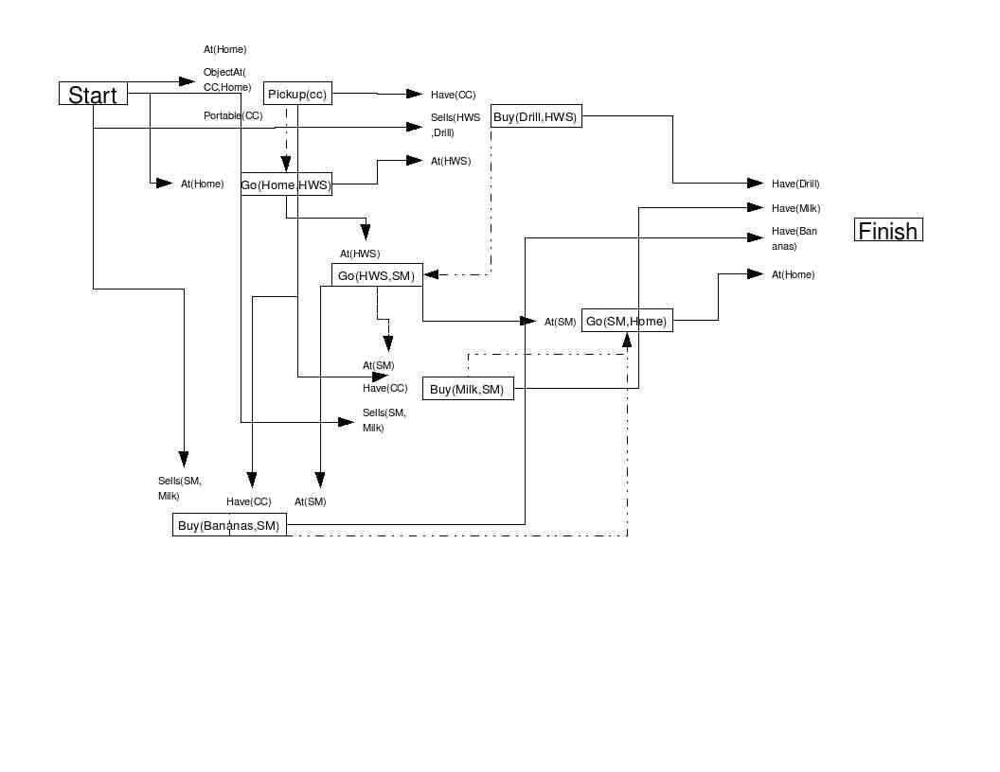
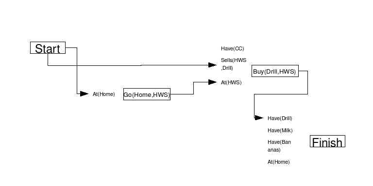
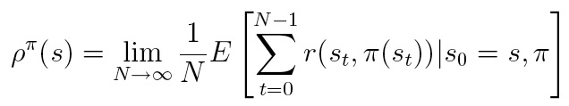

+++
title = "HW6"
+++

## Question
 

(10\%) Suppose you have have a STRIPS representation for actions A1 and A2, and you want to define the STRIPS representation for the composite action A1;A2, which means that you do A1 then do A2.

1. What is the add list for this composite action?

2. What is the delete list?

3. What are the preconditions for this composite action?

4. Give a possible STRIPS representation of the actions Move(here,there) and Pickup(object) and for the composite action Move(here,there);Pickup(object).

### Solution

Let the AL(A) and DL(A) denote the add and delete lists of the action A respectively. Let PC(A) denote the preconditions of the action A.

#### 1
: AL(A1;A2) consists of the elements of AL(A2), and those elements of the AL(A1) which will not be deleted by A2.

#### 2
: DL(A1;A2) consists of the elements of DL(A2), and those elements of DL(A1) which will not be added again by A2.

#### 3
: PC(A1;A2) consists of the elements of PC(A1), and those elements of PC(A2) which are not supplied by AL(A1).

#### 4
: A possible STRIPS representation follows:
$$\begin{eqnarray}
Action( Move(here,there), &\\
PRECOND: At(here) &\\
EFFECT: \sim At(here) \wedge At(there) )&\\
\end{eqnarray}$$

$$\begin{eqnarray}
Action( Pickup(object), &\\
PRECOND: At(here) \wedge ObjectAt(object, here) &\\
EFFECT: \sim ObjectAt(object, here) \wedge Possess(object) )&\\
\end{eqnarray}$$

$$\begin{eqnarray}
Action( Move(here,there);Pickup(object), &\\
PRECOND: At(here) \wedge ObjectAt(object, there) &\\
EFFECT: \sim At(here) \wedge At(there) \wedge \sim ObjectAt(object, there) \wedge Possess(object) )&\\
\end{eqnarray}$$

## Question
 
 (20\%) The towers of Hanoi problem is to move a set of n disks of different sizes from one peg to another, using a third peg for temporary storage. Disks are moved one at a time, and a larger disk cannot rest on a smaller one. (You might be familiar with a recursive algorithm for solving this problem.) Formulate this problem as a STRIPS-style planning problem. You will need to specify the initial state, the goal state, and the set of STRIPS-style operators. Feel free to use variables in operator description if needed.

### Solution

Initial state:
$$\begin{eqnarray}
On(Peg1, Disc1) \wedge \\
On(Disc1, Disc2) \wedge \\
On(Disc2, Disc3) \wedge \\
...\\
On(Discn_{n-1}, Disc_{n}) \wedge \\
Bigger(Peg1, Disc1) \wedge Bigger(Peg2, Disc1) \wedge Bigger(Peg3, Disc1) \wedge \\
Bigger(Peg1, Disc2) \wedge Bigger(Peg2, Disc2) \wedge Bigger(Peg3, Disc2) \wedge \\
...\\
Bigger(Peg1, Disc_{n}) \wedge Bigger(Peg2, Disc_{n}) \wedge Bigger(Peg3, Disc_{n}) \wedge \\
Bigger(Disc1, Disc2) \wedge \\
Bigger(Disc1, Disc3) \wedge Bigger(Disc2, Disc3) \wedge\\
...\\
Bigger(Disc1, Disc_{n}) \wedge ... \wedge Bigger(Discn_{n-1}, Disc_{n})\\
Clear(Disc_{n}) \wedge Clear(Peg2) \wedge Clear (Peg3)\\
\end{eqnarray}$$

Goal state:
$$\begin{eqnarray}
On(Peg3, Disc1) \wedge \\
On(Disc1, Disc2) \wedge \\
On(Disc2, Disc3) \wedge \\
...\\
On(Discn_{n-1}, Disc_{n}) \wedge \\
\end{eqnarray}$$

The action description (disc, source and dest are variables.):
$$\begin{eqnarray}
Action( Move(disc, source, dest), \\
PRECOND: Clear(disc) \wedge Clear(dest) \wedge  \\
Bigger(dest, disc) \wedge On(source, disc)\\
EFFECT: On(dest, disc) \wedge \sim Clear(dest) \wedge\\
Clear(dest) \wedge \sim On(source, disc)
\end{eqnarray}$$

## Question
 
 (20\%) Let us consider a version of the milk/banana/drill shopping problem in which money is included, at least in a simple way.

1. Let CC denote a credit card that the agent can use to buy any object. Modify the description of Buy so that the agent has to have its credit card in order to buy anything.

2. Write a Pickup operator that enables the agent to Have an object if it is portable and at the same location as the agent.

3. Assume that the credit card is at home, but Have(CC) is initially false. Construct a partially ordered plan that achieves the goal, showing both ordering constraints and causal links.

4. Explain in detail what happens during the planning process when the agent explores a partial plan in which it leaves home without the card. 

### Solution

#### 1
: The modified buy operator is described by the following:

$$\begin{eqnarray}
Action( Buy(p,s), \\
PRECOND: At(s) \wedge Sells(s,p) \wedge Have(CC)\\
EFFECTS: Have(p)
\end{eqnarray}$$

#### 2
: 'At(y)' denotes the presense of the agent at y.
$$\begin{eqnarray}
Action( Pickup(x), \\
PRECOND: Portable(x) \wedge At(y) \wedge ObjectAt(x,y)\\
EFFECTS: Have(p)
\end{eqnarray}$$

#### 3
: The plan, with the causal links and the constraints, is shown below.

{caption="" class="thumbnail"}

#### 4
: Let us consider an agent which implements 'Plan Space Planning'. For such an agent, plan flaws initially consist of all open goals. The agent iteratively refines a partial plan. At each step of the refinement, the agent non-deterministically resolves a flaw. Initially, the partial plan will consist of only the 'Start' and 'Finish' states.

The questions rquires us to consider the case when the agent explores *a* partial plan where the agent leaves home without the card. There are many partial plans where this happens. I will use the following partial plan to explain in detail what happens during the planning process when the agent explores such a plan (The argument can be extended to other compliant partial plans.): 

{caption="" class="thumbnail"}

The above is a plausible partial order plan which can be generated during 'Plan Space Planning'. We see that the set of flaws, F consists of the Open Goals: {Have(CC), Have(Milk), Have(Bananas), At(Home)}. Now, the agent generates the set of resolvers for these flaws. The set of resolvers are the actions {Pickup(CC), Buy(CC), Pickup(Milk), Buy(Milk), Pickup(Bananas), Buy(Bananas), Go(x, Home)}.

Note: Both Pickup(Milk) and Buy(Milk) can satisfy Have(Milk). But, Pickup(Milk) requires Portable(Milk), ObjectAt(x1,Milk) and At(x1); whereas Buy(Milk) requires Have(CC), At(SM) and Sells(SM,Milk). An agent choosing Pickup(Milk) will end up with a partial plan which cannot be further refined. Hence, let us assume that the agent is designed, in its stochastic choice of resolver to improve partial plans, to select Buy(Milk) rather than Pickup(Milk), because the former has more satisfied preconditions. Due to similar reasons, the agent will select Pickup(CC) over Buy(CC).

Now, it is possible that, in the next refinement of the partial plan, the agent selects Pickup(CC) to resolve the flaw of not having a credit card. As the action 'Start' provides At(Home) and ObjectAt(CC, Home), which are prerequisites of Pickup(CC), the agent adds a causal link from Start to Pickup(CC). Similarly, a causal link is added to Buy(Drill, HWS). Also, as the action Go(Home, HWS) negates At(Home), a constraint link is added from Pickup(CC) to Go(Home, HWS). Either after or before this refinement, the partial plan can or could have been refined so as to eliminate the flaws due to the unsatisfied prerequisites, Have(Milk), Have(Bananas) and At(Home) by the addition of suitable resolvers shown in the partial order plan provided in answer to the previous subquestion.

Thus, eventually, the agent arrives at a suitable partial order plan.

## Question
 
 (12\%) We have only considered planners that have goals of achievement: Take steps to ensure that a proposition is true at some time or in some situation. In this exercise, we consider goals of maintenance and prevention. Maintenance goals involve propositions that must remain true over a given interval of time. Prevention goals involve propositions that must never become true over a given interval of time. Discuss how maintenance and prevention goals can be handled by least commitment planning (e.g. the POP algorithm).

### Solution

Operators cause changes in the truth values of propositions. Prevention and Maintenance goals, thus boil down to the problem of scheduling actions, so that the truth values of certain propositions are fixed as required. Consider the prevention goal P, which states that A should be false in the time interval (ta1,ta2), and the maintenance goal M, which says that B should be true in the time interval (tb1,tb2).

Let us consider an agent which implements 'Plan Space Planning' (PSP). For such an agent, plan flaws initially consist of all open goals. The agent iteratively refines a partial plan. At each step of the refinement, the agent non-deterministically resolves a flaw. Initially, the partial plan will consist of only the 'Start' and 'Finish' states.

PSP can handle P and M by preprocessing the problem as follows: For the proposition to be prevented (A), create another proposition, NA, such that the truth value of NA is always the opposite of A. Modify all actions which alter the truth value of A to do so. Create new propositions PA(timeInterval) and MB(timeInterval) to indicate whether propositions A and B were prevented and maintained during a specified time interval.

Add PA(timeIntervalTA) and MB(timeIntervalTB) as preconditions for the 'Finish' state. After the 'Start' operator, their values should be 'false'. Add the actions ActP(timeInterval) and ActM(timeInterval), which merely provide PA(timeInterval) and MB(timeInterval) respectively as effects, and require NA and B respectively as prerequisites.

Voila! Now, we have arrived at a specification of the problem such that it can be solved by a 'Least Commitment Planner'. The PSP algorithm is sufficiently sophisticated, due to its ability to create constraint and causal links, to deal with a problem of this specification. When PSP solves the problem specified above, it ensures satisfaction of prevention and maintenance goals.

## Question

 (14\%) Sometimes MDPs are formulated with a reward function R(s,a) that depends on the action taken or a reward function R(s,a,s') that also depends on the outcome state.

1. Write the Bellman equations for these formulations.

2. Show how an MDP with reward function R(s,a,s') can be transformed into a different MDP with reward function R(s,a), such that the optimal policies in the new MDP correspond exactly to optimal policies in the original MDP.

3. Now do the same to convert MDPs with R(s,a) into MDPs with R(s).

### Solution

#### 1
 In an abstract sense, Bellman equations tell us that the utility of a given state can be calculated from the cumulative future rewards that can be obtained by following an optimum policy. I use this to guide my formulation of Bellman equations for the cases where rewards are of the form R(s,a) and R(s,a,s').

The Bellman equation when the reward function is of the form R(s) is this:
$$\begin{eqnarray}
U(s)=R(s)+g*max_{a}\sum_{s'}T(s,a,s')U(s')\\
\end{eqnarray}$$

The Bellman equation when the reward function is of the form R(s,a) is this:
$$\begin{eqnarray}
U(s)=max_{a}[R(s,a) + g*\sum_{s'}T(s,a,s')U(s')]\\
\end{eqnarray}$$

The Bellman equation when the reward function is of the form R(s,a,s') is this:
$$\begin{eqnarray}
U(s)=max_{a}\sum_{s'}T(s,a,s')[R(s,a,s') + g*U(s')]\\
\end{eqnarray}$$

#### 2

$$\begin{eqnarray}
U(s)=max_{a}\sum_{s'}T(s,a,s')[R(s,a,s') + g*U(s')]\\
U(s)=max_{a}\sum_{s'}T(s,a,s')R(s,a,s') + \sum_{s'}T(s,a,s')g*U(s')\\
But:T(s,a,s')=P(s'|a,s)\\
U(s)=max_{a}[\sum_{s'}P(s'|a,s)R(s,a,s') + \sum_{s'}T(s,a,s')g*U(s')]\\
\text{From the definition of conditional expectation: }\\
E[R(s,a,s')|s,a]=\sum_{s'}P(s'|a,s)R(s,a,s')\\
E[R(s,a,s')|s,a]\text{ is a function of s and a, } R'(s,a).\\
Hence: U(s)=max_{a}[R'(s,a) + \sum_{s'}T(s,a,s')g*U(s')]\\
\end{eqnarray}$$
Thus, we have reduced the Bellman equation where the reward function is of the form R(s,a,s') to a Bellman equation where the reward function is of the form R(s,a). During the above transformations, we have not really altered the value of the utility function for any state. Hence, the policy which is the solution of the latter Bellman equation will also solve the former.

#### 3

$$\begin{eqnarray}
U(s)=max_{a}[R(s,a) + g*\sum_{s'}T(s,a,s')U(s')]\\
\text{We define a new reward function: }\\
R'(s)=R(s,a) \text{where a is the maximizer of the previous expression.}\\
U(s)=R'(s)+max_{a}[g*\sum_{s'}T(s,a,s')U(s')]\\
\end{eqnarray}$$
Thus, we have reduced the Bellman equation where the reward function is of the form R(s,a) to a Bellman equation where the reward function is of the form R(s). During the above transformations, we have not really altered the value of the utility function for any state. Hence, the policy which is the solution of the latter Bellman equation will also solve the former.

## Question
 
 (24\%) The goal of this exercise is to give you an understanding of the possible disadvantages of using discounted rewards and to introduce the average reward criterion. Discounted optimization is motivated by domains where reward can be interpreted as money that can earn interest, or where there is a fixed probability that a run will be terminated at any given time. However, many problems do not have either of these properties. Discounting in such domains tends to sacrifice long-term rewards in favor of short-term rewards. Moreover, the discounted optimal policy may depend on the choice of the the discount factor. It is true that for any finite MDP (an MDP with finite state and action spaces) there is some sufficiently large \\(\lambda\\) for which the discounted and undiscounted measures agree. However, proper choice of such \\(\lambda\\) requires detailed knowledge of the problem. Even with such knowledge, a parameter such as \\(\lambda\\) that needs to be tailored to suit individual problems is clearly undesirable. Therefore, the agent may prefer to compare policies on the basis of their average expected reward instead of their expected discounted reward. The aim of the average reward MDP is to compute policies that yield the highest expected payoff per time step. The average reward or gain associated with a policy \\(\pi\\) at state s, is defined as follows (if the average reward exists):

{caption="" class="thumbnail"}

Consider the 14 state MDP whose state-transition diagram is given below. All transitions are deterministic. The agent receives a reward of +5 on moving from the Printer to Home and a reward of +20 on moving from the Mailroom to Home, all other rewards are zero.

{caption="" class="thumbnail"}

1. How many distinct deterministic policies are there for this MDP? What are they?

2. For each policy, give an expression for the value of state 1 (assuming discounting)?

3. For what values of \\(\lambda\\) in [0,1) does an optimal policy take the agent to the Printer?

4. For what values of \\(\lambda\\) in [0,1) does an optimal policy take the agent to the Mailroom?

5. A policy \\(\pi\\) is called "Blackwell optimal" for a discounted MDP if there is a \\(\lambda\\)* in [0,1) such that \\(\pi\\) is optimal for all \\(\lambda\\) in [\\(\lambda\\)*,1). Does this problem have any Blackwell optimal policies? Explain your answer.

6. For each policy, calculate the average reward of state 1. Which policy should the agent follow if it seeks to optimize the average reward?

7. For what range of values of the discount factor \\(\lambda\\) will the agent select a policy that maximizes the average reward?

### Solution

#### 1
 There are 2 distinct deterministic policies for the given Markov Decision process. \\(\pi(s)\\) for any state other than state 1 can only be to execute the sole possible action. Only when the agent is in the state 1, there can be two distinct policies of action. So, one policy, P, requires an agent in state 1 to go to state 2. The other policy, P', requires an agent in state 1 to go to state 2'.

#### 2
 
Note that the reward function, which is specified based on transitions rather than states, can be restated, without any loss of generality as a reward function whose value depends on the states it visits: We define \\(R(s1)=R'(s1\rightarrow s2)\\). The Bellman equation:
$$\begin{eqnarray}
U(s)=R(s)+g*max_{a}\sum_{s'}T(s,a,s')U(s')\\
\text{Expanding the Bellman equation repeatedly, for policy P:}\\
U(1)=R(1)+gR(2)+g^{2}R(3)+g^{3}R(4)+g^{4}R(5)+g^{6}R(1)...\\
\text{But, only R(5) has a non zero value.}\\
U(1)=g^{4}R(5)+g^{9}R(5)...\\
U(1)=g^{4}R(5)(1+g^{5}+g^{10}...)\\
\text{The geometric series shown above converges because }0<g^{5}<1\\
U(1)=g^{4}R(5)[\frac{1}{1-g^{5}}]=5g^{4}[\frac{1}{1-g^{5}}]\\
\text{Similarly, for policy P':}\\
U'(1)=g^{9}R(10')[\frac{1}{1-g^{10}}]=20g^{9}[\frac{1}{1-g^{10}}]\\
\end{eqnarray}$$

#### 3
 
We want to find some \\(\lambda\\), for which the optimal policy, when the agent is at 1, will be for the agent to go to 2, rather than 2'. This means that:
$$\begin{eqnarray}
U(1)>U'(1)\\
5g^{4}[\frac{1}{1-g^{5}}]>20g^{9}[\frac{1}{1-g^{10}}]\\
\frac{1}{1-g^{5}}>4g^{5}[\frac{1}{(1-g^{5})(1+g^{5})}]\\
1>4g^{5}[\frac{1}{(1+g^{5})}]\\
(1+g^{5})>4g^{5}\\
1>3g^{5}\\
3^{-1/5}>g\\
\end{eqnarray}$$
We know that \\(g>=0\\). Hence, when g (or \\(\lambda\\)) is in \\((0,3^{-1/5})\\), the optimal policy takes the agent to the printer. Note that \\(3^{-1/5}=0.803\\).

#### 4
 
By similar reasoning, when g (or \\(\lambda\\)) is in \\((3^{-1/5},1)\\), the optimal policy takes the agent to the mailing room.

#### 5
 As explained above, when \\(\lambda\\) is in \\((3^{-1/5},1)\\), the policy P' is optimal. When, \\(\lambda\\) is \\(3^{-1/5}\\), both P and P' are optimal. Hence, for the range \\([3^{-1/5},1)\\), the policy P' is optimal. Hence, the policy does indeed have a Blackwell optimal policy, and that policy is P', where the agent goes to 2' instead of 2.

#### 6
 
Average reward is defined by:
$$\begin{eqnarray}
R'(s)=\lim_{N\rightarrow \infty}\frac{1}{N}E[\sum_{t=0..N-1}r(s_{t},\pi(s_{t}))|s_{0}=s,\pi]\\
\end{eqnarray}$$

For policy P, at time 0, the agent is in state 1. At time x, the agent is in state (x\%5)+1. Every 5 time-steps, the agent accrues a reward of 5 units. Hence, using this information in the defining equation for average reward:
$$\begin{eqnarray}
R'(0)=\lim_{N\rightarrow \infty}\frac{1}{N}E[\sum_{t=0..\lfloor(N-1)/5\rfloor}5]\\
\text{Using the definition of the multiplication operation :-) :} \\
R'(0)=\lim_{N\rightarrow \infty}\frac{1}{N}E[5(\lfloor(N-1)/5\rfloor+1)]\\
R'(0)=\lim_{N\rightarrow \infty}\frac{5(\lfloor(N-1)/5\rfloor+1)}{N}\\
But: \lim_{N\rightarrow \infty}\lfloor(N-1)/5\rfloor+1=(N-1)/5\\
So: R'(0)=\lim_{N\rightarrow \infty}\frac{(N-1)}{N}=1\\
\end{eqnarray}$$

For policy P', at time 0, the agent is in state 1. At time x, the agent is in state (x\%10)+1. Every 10 time-steps, the agent accrues a reward of 20 units. Hence, using this information in the defining equation for average reward:
$$\begin{eqnarray}
R'(0)=\lim_{N\rightarrow \infty}\frac{1}{N}E[\sum_{t=0..\lfloor(N-1)/10\rfloor}20]\\
\text{Using the definition of the multiplication operation :-) :} \\
R'(0)=\lim_{N\rightarrow \infty}\frac{1}{N}E[20(\lfloor(N-1)/10\rfloor+1)]\\
R'(0)=\lim_{N\rightarrow \infty}\frac{20(\lfloor(N-1)/10\rfloor+1)}{N}\\
But: \lim_{N\rightarrow \infty}\lfloor(N-1)/10\rfloor+1=(N-1)/10\\
So: R'(0)=\lim_{N\rightarrow \infty}\frac{2(N-1)}{N}=2\\
\end{eqnarray}$$

So, an agent wanting to optimize average reward should choose policy P', according to which, it goes to 2' instead of 2 from 1.

#### 7
 Putting together the answers to subquestions 4 and 6, it follows that when g (or \\(\lambda\\)) is in \\((3^{-1/5},1)\\), the optimal policy takes the agent to the mailing room (the course of action that maximizes the average reward).
