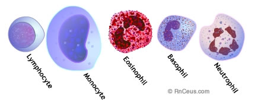

+++
title = "+Granulocyte"

+++

{caption="" class="thumbnail"}

- have granules in their cell cytoplasm. Also, nuclei are lobed/ seemingly segmented. Aka polymorphonuclear leukocytes or "polys" or "segs"
