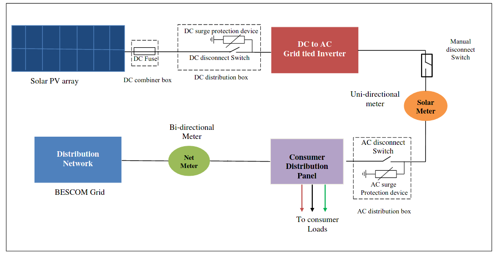

+++
title = "+Solar"
+++

## Systems:
- On-grid (with 2 way meter - to supply generated electricity to grid)
- On-grid without 2-way meter
- Off-grid
- Hybrid (aka Solar primary)

Hybrid and off-grid need battery. Battery costs generally too high. 

### Circuit details
- Panels (PV cells connected in series) generate DC electricity. Output is 24V or 12V usually.
- Panel output is connected to inverter and then to AC load or bi-directional meter.
- There may be just 1 inverter for all panels (common in off-grid or hybrid systems). Or there may be 1 "micro inverter" per panel (common in on-grid systems).
- Additionally, there may be good lightening arrestor and earthing. 
- Multiple panels connected in parallel may be connected in parallel to a battery and single inverter (in case of hybrid system).

## Components
- See panels [page](panels/).
- See [inverters page](../inverter/).

## On-grid billing and metering
- Billing
  - There will be a bidirectional meter: measuring electricity consumed, as well as electricity delivered. The electricity may be delivered after household consumption (aka net metering by BESCOM) - or before (aka gross metering by BESCOM).
  - Subtraction in the final bill, potentially money back at a certain lower rate (paid annually) for excess electricity delivered.
- Excess units of current generated during summer will be accumulated. Some of these excess units will be used in cloudy season. Leftover will be purchased annually by electric company.
- If grid power is down - solar power generation will not be sent to grid. 

{caption="" class="thumbnail"}

{caption="" class="thumbnail"}
