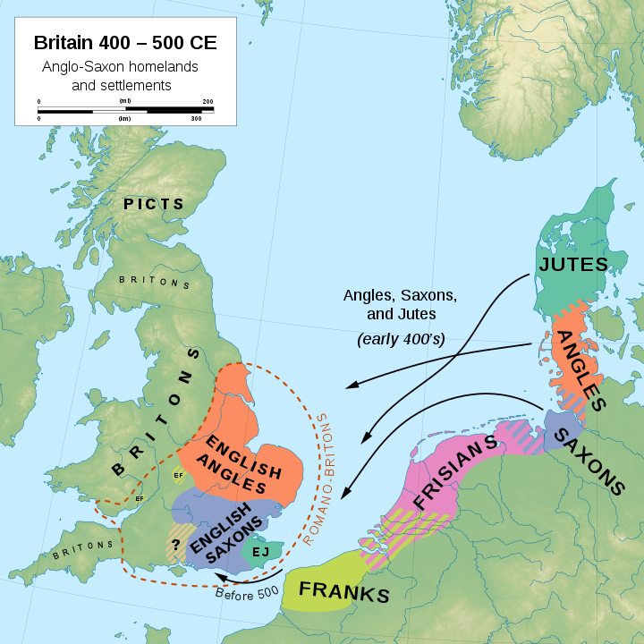

+++
title = "+Germanic"
+++

## Ethnonyms
- Ger-man= spear-man
- Franks: Frankea= spear, symbol of Wodan
- Saxons: Saxs= sword, symbol of Saxnot also known as Freyr in North Germanic world.
- Agnles: eng=narrow.

> Odinn iti rudra-varga-devatA | tasya lakShaNaM shulam | Frank eko germano janaH | tasya janasya lakShaNaM Odinn's shUlam |  Freyr iti prajApati-varga-devatA | kimartham? tasya pradhAnAM vrataM prajAtIti | tasmAt tasya cihnaM li~Ngam | anyathA tasya lakShanaM khaDgaH | Germanic bhAShyAm 'seaks' tena Saxon iti Freyr devasya janaH  (prAjApatya) | - MT

## Britannia

{caption="" class="thumbnail"}

- WW 1, 12% of british soldiers died. 17% of their officers. 20% of the graduates of eton who served in the war. son of the wartime prime minister. one future PM lost a son. another two brothers.