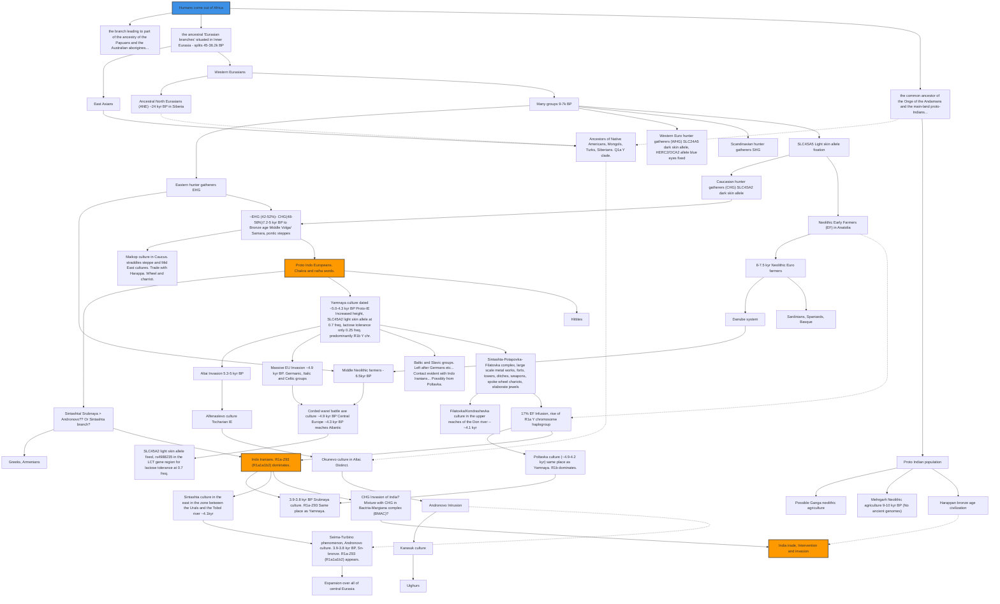

+++
title = "Indian forming chart"
js_extras = ["mermaid"]

+++

विस्तारः (द्रष्टुं नोद्यम्)

 [20151212](https://manasataramgini.wordpress.com/2015/12/12/a-note-on-the-early-expansions-of-the-indo-europeans/) 
 
- [mermaidchart](https://rebrand.ly/IA_MT)
- [img](../images/mt_2015.png),
- mindmap mup base file [here](https://drive.google.com/file/d/1NOmH-j3NARqK7pDt8Gq2EJyVJ2xHvNr9/view?usp=sharing))

## Geographic overlay

{caption="Geographic overlay"}