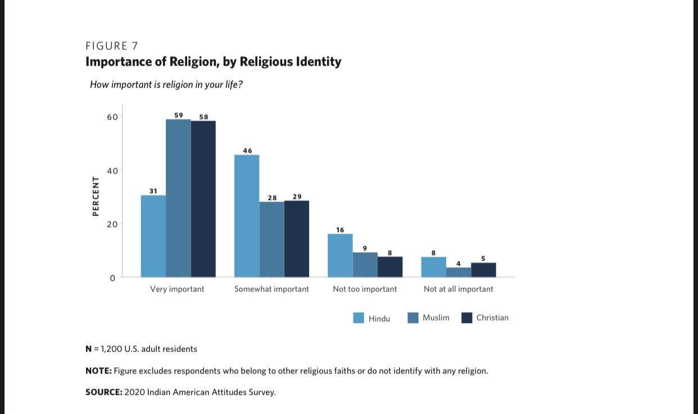

+++
title = "Religion"

+++
- While nearly three-quarters of Indian Americans state that religion plays an important role in their lives, religious practice is less pronounced. Forty percent of respondents pray at least once a day and 27 percent attend religious services at least once a week.

{caption="" class="thumbnail"}

{caption="" class="thumbnail"}

